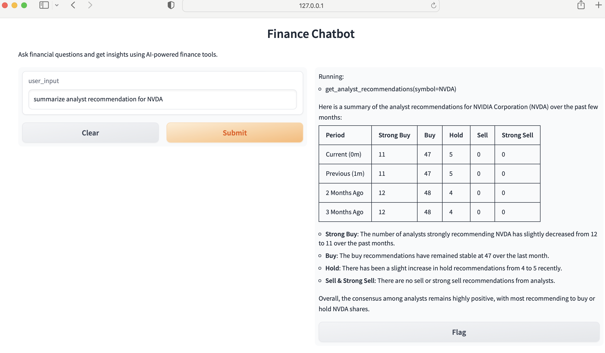

# Setting Up Your Python Environment

Follow these steps to set up a virtual Python environment and install the required packages.

## 1. Create a Virtual Python Environment
```bash
python -m venv phidata
```

## 2. Activate the Virtual Environment
On macOS/Linux:
```bash
source phidata/bin/activate
```
On Windows:
```bash
phidata\\Scripts\\activate
```

## 3. Install Required Python Packages
Install the core package:
```bash
pip install -U phidata
```

### Additional Packages
- **For Web Search Agent:**
  ```bash
  pip install openai duckduckgo-search phidata
  ```
- **For Finance Agent:**
  ```bash
  pip install openai yfinance phidata
  ```

## 4. Set Up API Key
Ensure you have set your `OPENAI_API_KEY` appropriately:
```bash
export OPENAI_API_KEY="your_api_key_here"
```

## 5. Run python program
```bash
python financeagent.py
```

## 5. This will open up a gradient interface


